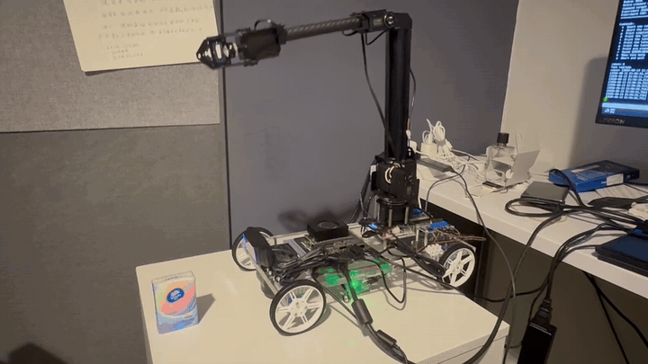
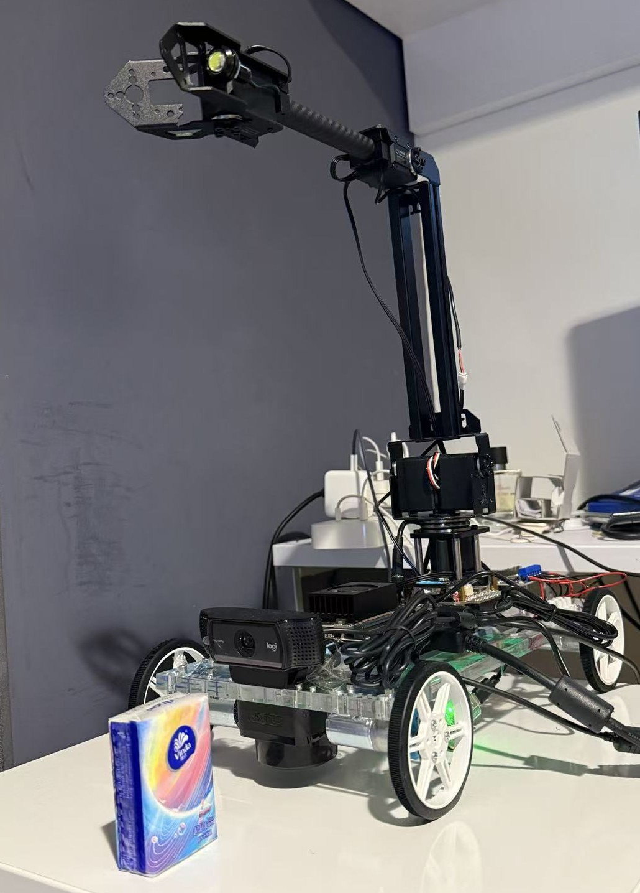

# Jetson Orin Nano Vision-Guided Robotic Manipulation

A real-hardware robotics project integrating **YOLOv8 perception**, **RPLIDAR C1 ranging**, calibrated target localization, motion planning, and **RoArm-M2-S** execution on an **NVIDIA Jetson Orin Nano**.

<!--
Portfolio media slots.
After adding the files under docs/assets/, remove this comment wrapper.

<p align="center">
  
</p>

<p align="center">
  
</p>
-->

## System overview

```text
USB Camera
   |
YOLOv8 target detection
   |
   +-------------------+
   |                   |
RPLIDAR C1             |
   |                   |
Target-sector range    |
   +---------+---------+
             |
     Target localization
             |
   Calibrated command mapping
             |
      Workspace validation
             |
       Motion planning
             |
       RoArm-M2-S
```

The production pipeline follows:

```text
YOLO detection
  -> camera-guided RPLIDAR ranging
  -> base_link target localization
  -> measured command calibration
  -> four-waypoint grasp-pose planning
  -> feedback-verified RoArm execution
```

## Key engineering features

- Modular hardware interfaces for the USB camera, RPLIDAR C1, and RoArm-M2-S.
- Custom YOLOv8 target detector with confidence and multi-frame stability filtering.
- Camera-guided LiDAR sector selection for target-specific range estimation.
- Sensor-to-`base_link` localization with measured geometric calibration.
- Workspace-aware target validation and guarded real-hardware execution.
- Structured JSONL/CSV experiment logging for every completed, aborted, or failed pipeline run.
- Hardware-independent mock adapters and regression tests for development without the robot connected.
- Dockerized Jetson development environment.
- ROS 2 Humble / MoveIt 2 workspace with URDF/TF, real `/joint_states`, IK, collision-aware planning, current-TCP pose output, and guarded arm-only trajectory execution.
- GitHub Actions workflows for no-hardware regression and ROS 2 static validation.

## Calibration results

The current command-space calibration was fitted from **11 manually taught tool-centre poses** distributed across the reachable workspace.

| Metric | Result |
|---|---:|
| Global bilinear training planar RMSE | **5.87 mm** |
| Local residual fitting RMSE | **0.535 mm** |
| Leave-one-position-out planar RMSE | **7.96 mm** |
| Previous model error on overlapping newly taught points | **21.37 mm** |

The production model combines a global `bilinear_xy` mapping with a bounded `bilinear_local_xy` residual layer using a Wendland-C2 basis. These metrics describe **command-space calibration error**, not end-to-end physical grasp accuracy.

## Hardware

- NVIDIA Jetson Orin Nano
- Waveshare RoArm-M2-S
- Slamtec RPLIDAR C1
- USB camera

## Software stack

- Python
- ROS 2 Humble
- MoveIt 2
- OpenCV
- Ultralytics YOLOv8
- Docker
- GitHub Actions
- RPLIDAR SDK

## Quick start

Clone the repository together with the RPLIDAR SDK submodule:

```bash
git clone --recurse-submodules \
  https://github.com/lester-zed/eee8097-jetson-robotics.git
cd eee8097-jetson-robotics
```

Build and start the Jetson development container:

```bash
./scripts/build_docker.sh
./scripts/run_docker.sh
```

Inside the container, run the no-hardware validation suite:

```bash
cd /workspace/src
./test_modular_pipeline.sh

python3 main_modular.py \
  --config configs/modular_pipeline.yaml \
  --validate-config
```

## Real-hardware workflow

Run the read-only device health check first:

```bash
cd /workspace/src
./run_robot_healthcheck.sh
```

Before real motion, validate the same perception, localization, calibration, and planning path with a mock arm:

```bash
./run_modular_pipeline.sh configs/calibrated_plan_only.yaml
```

Run the real pipeline only after the workspace is clear and the hardware profile has been reviewed:

```bash
./run_modular_pipeline.sh
```

> [!CAUTION]
> `src/configs/modular_pipeline.yaml` is an operator-validated real-hardware profile. The pipeline can command physical motion after its typed confirmation gate. Keep direct access to the hardware power switch during execution.

## ROS 2 / MoveIt 2

A separate ROS 2 Humble workspace provides planning and guarded arm execution without changing the perception container.

```bash
cd /workspace/src/ros2_ws
python3 test_static.py
./build_ros2.sh
./run_safe_moveit.sh plan
```

For real-state observation and execution modes, see [`src/docs/ROS2_MOVEIT2_SAFE_ARM_ONLY.md`](src/docs/ROS2_MOVEIT2_SAFE_ARM_ONLY.md).

The perception pipeline and ROS 2 driver must never own `/dev/ttyROARM` at the same time.

## Main entry points

| Purpose | Entry point |
|---|---|
| Full perception-to-motion pipeline | `src/run_modular_pipeline.sh` |
| Pipeline implementation | `src/main_modular.py` |
| Real-hardware configuration | `src/configs/modular_pipeline.yaml` |
| No-motion health check | `src/run_robot_healthcheck.sh` |
| Startup joint self-test | `src/run_robot_startup_test.sh` |
| Manual Cartesian arm test | `src/run_roarm_manual_test.sh` |
| Dataset capture | `src/run_tissue_capture.sh` |
| Calibration capture | `src/run_calibration_capture.sh` |
| Calibration / experiment report | `src/run_calibration_report.sh` |
| ROS 2 / MoveIt 2 workspace | `src/ros2_ws/` |
| ROS 2 container helper | `scripts/run_ros2_docker.sh` |

## Repository layout

```text
docker/                 Jetson container definitions
scripts/                Host-side build and container launch helpers
src/configs/            Runtime hardware and planning profiles
src/interfaces/         Stable component contracts
src/adapters/           Mock device adapters
src/vision/             YOLO camera implementation
src/lidar/              RPLIDAR parsing and target-sector ranging
src/localization/       Sensor-to-base localization and command calibration
src/planning/           Workspace checks and motion waypoints
src/arm_control/        UART, Cartesian execution, home, and self-test
src/pipeline/           Canonical task state machine
src/experiments/        Structured run records and calibration statistics
src/tests/              No-hardware regression tests and calibration fixtures
src/docs/               Engineering documentation
src/ros2_ws/            ROS 2 Humble, MoveIt 2, and guarded real-arm bridge
docs/assets/            README demo and hardware media
```

Detailed engineering documentation is indexed in [`src/docs/README.md`](src/docs/README.md). Repository ownership and change-management conventions are documented in [`src/docs/REPOSITORY_STRUCTURE.md`](src/docs/REPOSITORY_STRUCTURE.md).

## Model weights

The custom YOLO model is a runtime artifact and is intentionally not stored in the source tree. The real-hardware profile expects:

```text
/workspace/models/tissue_pack_yolov8n_v1.pt
```

Place the trained weight file in `models/` before running the real vision pipeline. Mock and static validation paths do not require the physical robot.

## Adding portfolio media

The repository is prepared for:

```text
docs/assets/demo.gif
docs/assets/hardware_overview.jpg
```

See [`docs/assets/README.md`](docs/assets/README.md) for recommended GIF conversion, image sizing, and the exact README snippet to enable after the files are added.
